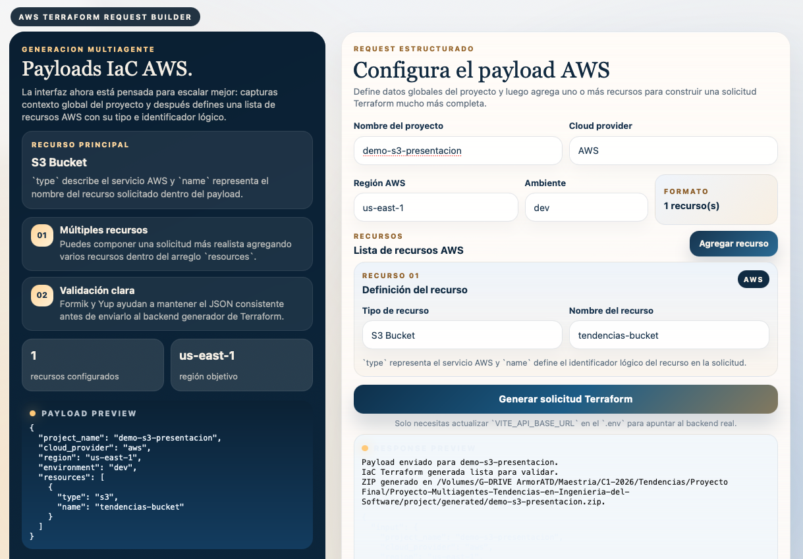
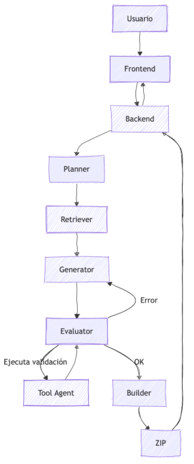

# Proyecto Multiagentes para Generacion de Terraform en AWS



## Descripcion

Este repositorio implementa una solucion para generar proyectos Terraform en AWS a partir de un request estructurado enviado desde un frontend web.

La plataforma esta dividida en dos partes:

- `PSWE-01`: frontend en React/Vite para construir y enviar el payload
- `project`: backend en FastAPI para procesar la solicitud, generar IaC y empaquetar el resultado con una arquitectura multiagente

## Funcionamiento general

El flujo actual del backend sigue estas etapas:

1. recibe un `POST /api/agent`
2. valida y normaliza el request
3. ejecuta un flujo secuencial de agentes
4. genera archivos Terraform
5. copia modulos locales cuando corresponde
6. construye un `.zip` con el proyecto generado

Los agentes principales son:

- `PlannerAgent`
- `RetrieverAgent`
- `GeneratorAgent`
- `BuilderAgent`

## Entrada esperada

El backend acepta el mismo formato que genera hoy el frontend:

```json
{
  "project_name": "demo-s3-module",
  "cloud_provider": "aws",
  "region": "us-east-1",
  "environment": "dev",
  "resources": [
    {
      "type": "s3",
      "name": "tendencias-bucket"
    }
  ]
}
```

A partir de `resources`, el backend deriva la estructura interna necesaria para el flujo de generacion.

## Recursos y modulos

El proyecto ya incluye soporte local para modulo S3 en:

- `project/app/modules/aws/s3-bucket`

Cuando la solicitud incluye un recurso `s3`, el sistema genera el proyecto Terraform usando ese modulo y lo copia dentro del output final.

Los proyectos generados se escriben en:

- `project/generated/`

## Usando modules

### S3 Bucket

El módulo oficial para crear buckets en AWS S3 (`terraform-aws-modules/s3-bucket/aws`) incluye **más de 80 variables** posibles para configurar detalles como versioning, ACLs, políticas, cifrado, logging, CORS, lifecycle rules, replicación, entre muchas otras opciones avanzadas.

## API

### `GET /`

Verificacion basica del backend.

### `POST /api/agent`

Procesa el request y devuelve el resultado del flujo de generacion.

### `GET /api/agent/download/{project_name}`

Devuelve el archivo `.zip` generado para el proyecto solicitado.

## Estructura principal

```text
PSWE-01/
  src/
  .env.example

project/
  app/
    agents/
    kernel/
    models/
    modules/
      aws/
        s3-bucket/
    orchestrator/
    routes/
    services/
    main.py
    requirements.txt
  generated/
  .env.example
```

## Variables de entorno

### Backend

Archivo local:

- `project/.env`

Plantilla:

- `project/.env.example`

Variables esperadas:

```env
AZURE_OPENAI_ENDPOINT="https://your-resource-name.cognitiveservices.azure.com/"
AZURE_OPENAI_API_KEY="YOUR_AZURE_OPENAI_API_KEY"
AZURE_OPENAI_DEPLOYMENT="gpt-5.4-mini"
AZURE_OPENAI_API_VERSION="2024-12-01-preview"
```

### Frontend

Archivo local:

- `PSWE-01/.env`

Plantilla:

- `PSWE-01/.env.example`

Variable principal:

```env
VITE_API_BASE_URL=http://127.0.0.1:8000
```

## Como ejecutar el backend

Desde la carpeta `project`:

```bash
source venv/bin/activate
pip install -r app/requirements.txt
python -m uvicorn app.main:app --reload --host 127.0.0.1 --port 8000
```

Backend disponible en:

```text
http://127.0.0.1:8000
```

Documentacion interactiva:

```text
http://127.0.0.1:8000/docs
```

## Como ejecutar el frontend

Desde la carpeta `PSWE-01`:

```bash
npm install
npm run dev
```

La aplicacion corre normalmente en:

```text
http://localhost:5173
```

## Validacion manual de Terraform

Desde la carpeta de un proyecto generado:

```bash
cd project/generated/demo-s3-module
terraform init
terraform fmt -check
terraform validate
```

Si quieres inspeccionar el plan:

```bash
terraform plan
```

## Notas

- El backend utiliza Azure OpenAI mediante variables de entorno configuradas localmente.
- Los archivos `.env` reales no deben versionarse; el repositorio incluye archivos `.env.example`.
- La validacion de Terraform se realiza manualmente desde terminal sobre el proyecto generado.

## Referencia visual

El siguiente diagrama resume la idea general de arquitectura y el enfoque planteado para el desarrollo:



En la implementacion actual, el resultado final del flujo es un proyecto Terraform generado y empaquetado, mientras que la validacion de Terraform se ejecuta manualmente desde consola.
